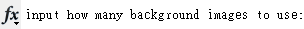
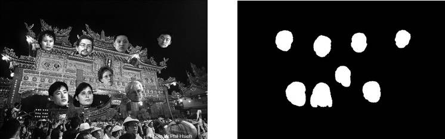
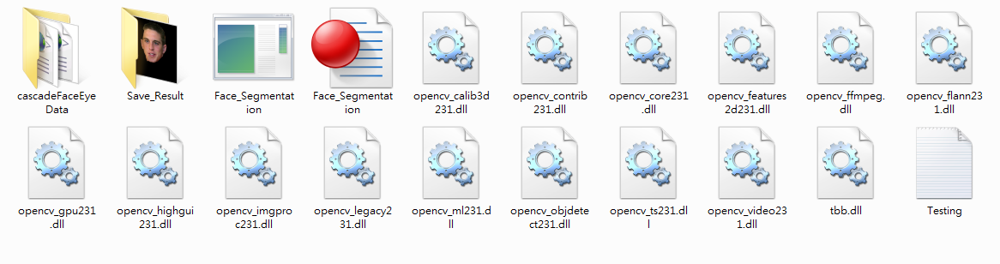
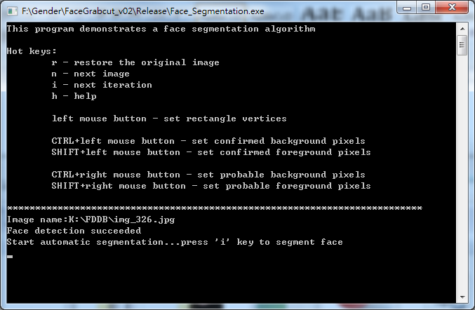
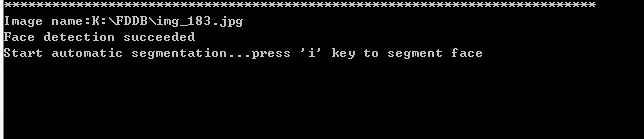
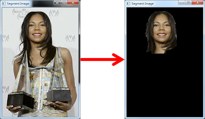
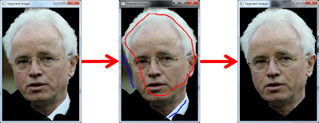
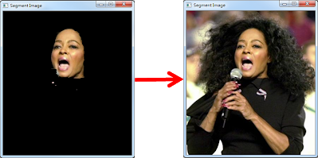
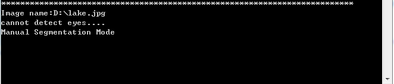
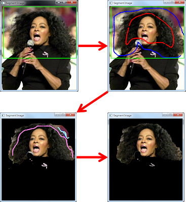

# A Framework for Making Face Detection Benchmark Databases ([Website](https://sites.google.com/site/avlabbenchmark/))

Gee-Sern Hsu , Tsu-Ying Chu

The images in face detection benchmark databases are mostly taken by consumer cameras, and thus are constrained by popular preferences, including a frontal pose and balanced lighting conditions. A good face detector should consider beyond such constraints and work well for other types of images, for example, those captured by a surveillance camera. To overcome such constraints, a framework is proposed to transform a mother database, originally made for benchmarking face recognition, to daughter datasets that are good for benchmarking face detection.The daughter datasets can be customized to meet the requirements of various performance criteria; therefore, a face detector can be better evaluated on desired datasets. The framework is composed of two phases: 1) intrinsic parametrization (IP) and 2) extrinsic parametrization (EP). A few daughter datasets were designed with the following intrinsic parameters 1) Pose set 2) Illumination frontal set 3) Illumination downward set 4) Occlusion set 5) Orientation set.

Table of Contents
--
* [Quick Guide](#Quick-Guide)
  * 1. [Face synthesis](#face-synthesis-quick-guide)
  * 2. [Face Segmentation](#Face-Segmentation-Quick-Guide)
  * 3. [Illumination Cone](#illumination-cone-quick-guide)
* [Update](#Update)
* [Data Download](#Data-Download)
* [How to get a Password](#How-to-get-a-Password)
* [Restriction](#Restriction)
* [Download Link](#Download-Link)
* [Citation and Contact](#Citation-and-Contact)

Face synthesis Quick Guide
--
   Please proceed the following steps to run this demo:

   **1. Set the following parameters in Exp3.m before executing it.** 
    
    PIE_face_path (path to the cropped face images)
    person (number of faces to be synthesized per image)
    pose_distribution (IDs of pose in PIE)
    illuminated_distribution (IDs of illumination condition in PIE)
    <font color="red">%%%ORIENTATION PARAMETER</font>
    pdmax=25*(pi/180);
    pdmin=-25*(pi/180);
    <font color="red">%%%FACIAL SIZE</font>
    smax=0.2;
    smin=0.1
    
   **2. Execute Exp3.m, and input the number of background image.** 
   
<p align="left">
	       
</p>
  
   **3. Manually annotate the centers of faces to be synthesized.**
<p align="center">
	       
</p>
   
   **4. The synthesized images and corresponding face masks will be automatically saved in the ”result” folder. The file name will be saved as ”syn_X.jpg” and “gd_X.jpg”, where X is the background image    number.**
<p align="center">
	       
</p>

   
   
Face Segmentation Quick Guide
--
   Please proceed the following steps to run this demo:
  
   **1. Please unzip the file “Face_Segmentation.rar”. Then prepare a list of image path named as “Testing.txt” and put it under the directory of program.** 
  
   
  
   **2. Double click on Face_Segmentation.exe to execute.** 
  
   <p align="center">
	       
   </p>
   <p align="center">
	       
   </p>
  
   **3. If the image exists, it will be displayed in the “Segment Image” window.** 
   <p align="center">
	       
   </p>

  
### Automatic Mode

  
  - **When face detection succeeded, press “i” to operate under the Automatic Mode.** 
    <p align="center">
       
       
    </p>
  - **When the result of automatic segmentation is not satisfactory, you can add some background and foreground seeds to improve the performance.** 
     ###### 1.  Automatic segmentation result
     ###### 2.  Mark some confirmed foreground pixels (red) and background pixels (blue)
     ###### 3.  Result after adding the constraints

      <p align="center">
       
      </p>
  
  ### Manual Mode
 
  
  - **If the result is still not good, please press “r” to restore the image and switch to the Manual Mode.**
    <p align="center">
        
	
    </p>
  
   ###### 1.   Set a rectangular area around the face you want to segment.
   ###### 2.   Mark some confirmed foreground and background pixels.
   ###### 3.   Mark probable foreground and background pixels.
   ###### 4.   Manual Segmentation Result.
   
   <p align="center">
        
    </p>
   ### Save Result
   
  
  - **When “n” key is pressed, the current segmented face will be saved in the “Save_Result” folder and the next test image will be displayed.**
  
      
  
  Illumination Cone Quick Guide
  --
  
   Please proceed the following steps to run this demo:
  
   -**Set the following parameters in run3.m before executing it.**
   
     Filename (images to load)
   
   
   
      save_path (directory to save result images)
      width (image width)
      height (image height)
   
   -**Execute run3.m. The result images with different illumination conditions will be automatically saved.**
   
   
   
   Note: The setting of the light sources can be adjusted by modify this parameter:
   
   
  
We hope that the Face-Detection-Database database could revolutionized the landscape of heart rate detection research. A detailed introduction of Face-Detection-Database-Benchmark can be found in the [paper](https://ieeexplore.ieee.org/abstract/document/6522507).

Update
--
|Date|Updata|
|----|------|
|2013-06-03|Face-Detection-Database-Benchmark is composed and made available to the research community.|


Data Download 
--
 1. [Get a password](#how-to-get-a-password)
 2. [Restriction](#restriction)
 3. [Download Link](#download-link)
 
How to get a Password
-
Please send an e-mail to the database administrator and cc. to Prof. Gee-Sern (Jison) Hsu to receive the passcode to unlock the zipped database. Your Email MUST be sent from a valid University account and include the following [request forms](./RequestForms.txt):

```
Subject: Application to download the Face-Detection-Database-Benchmark database
Name: <your first and last name>
Affiliation: <University where you work>
Department: <your department>
Current position: <your job title>
Email: <must be the email at the above mentioned institution>
Postal Address:
Phone number:
I have read and agreed to follow the restrictions specified in the Face-Detection-Database-Benchmark database webpage. This database will only be used for research purposes. I will not make any part of this database available to a third party. I'll not sell any part of this database or make any profit from its use.
<your signature>
```
In general, a password will take 3-7 workdays to issue. To avoid problems with our spam filter, make sure that your email is sent from an .edu (or similar) address. Failure to follow the instruction may result in no response. 

Database administrator: qunc85@gmail.com

Prof. Hsu's e-mail: jison@mail.ntust.edu.tw


Restriction
-
To guarantee the proper use of this database, the following restrictions must be followed by any person who has downloaded the database.
 1. All submissions, publications, and works that use or talk about the Face-Detection-Database-Benchmark database must cite the paper. 
 2. Permission is NOT granted to reproduce or distribute the database. 
 3. Written permission must be approved by Prof. Gee-Sern Hsu if a faculty member desires to share the database with her/his co-workers or students. Even then, the database cannot be posted on a webpage accessible from outside the faculty research group. 
 4. No economical profit can be made from this database. 
 
No country or institution is excluded of any of the above restrictions. Failure to follow the restrictions will be legally prosecuted.

Download Link
-
This is Download Link of Test Image <br>
[Face-Detection-Database-Benchmark Download Link](https://docs.google.com/file/d/0BwJ2me84dFHIQ0tvUDZPSHR2NGc/edit)<br>
This dataset about 1.Pose 2. Illumination-Frontal  3.Illumination-Downward 4.Occulsion 5.Orientation <br>
[5 Dataset Images](https://docs.google.com/file/d/0BwJ2me84dFHITFIzWDhNeERtcnM/edit)


Citation and Contact
--
If you like our work or find Face-Detection-Database-Benchmark dataset useful, please cite the following paper：
```
@article{hsu2013framework,
  title={A framework for making face detection benchmark databases},
  author={Hsu, Gee-Sern and Chu, Tsu-Ying},
  journal={TCSVT},
  year={2013},
}
```
Any suggestion or comment would be valuable. Please send an email to corresponding author (Gee-Sern Hsu) or Database administrator.
